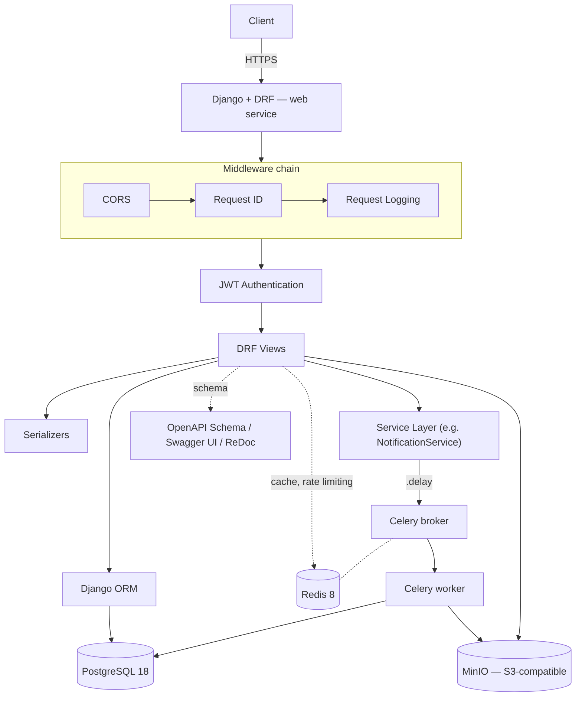
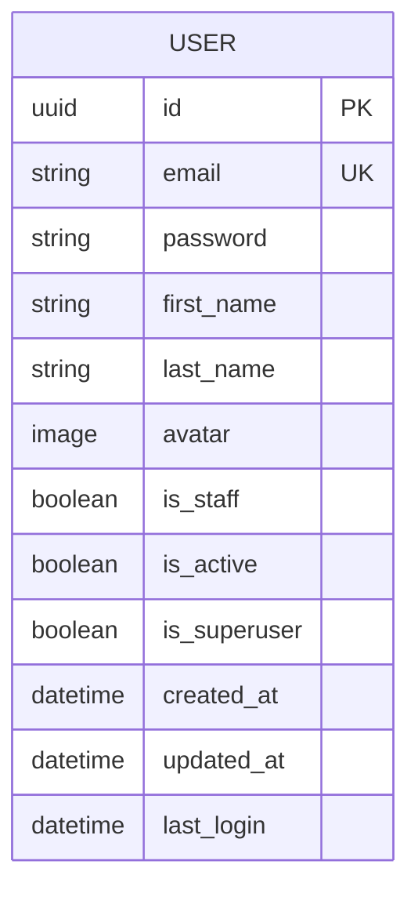

# Architecture

## System overview

Layers, top to bottom:

- **Middleware chain** — CORS, request-ID assignment, and request logging
  run before anything else (`apps/common/middleware.py`).
- **Views** — thin; validate input, call a service or the ORM directly,
  return a `Response` (Constitution, Rule 2 — no business logic in views).
- **Service layer** — non-trivial business logic (today: `NotificationService`).
  New services should follow the same pattern rather than putting logic in
  views or models.
- **Background workers** — Celery, sharing PostgreSQL and MinIO access
  with the web process, but running in a separate container.
- **Storage** — PostgreSQL for relational data, MinIO for files, Redis for
  both the Celery broker/backend and the cache/rate-limit store (separate
  logical databases — see `DECISIONS.md` and the Day 9 session notes).

## Entity-relationship diagram

Only `User` exists as a concrete model today. `UUIDMixin` and
`TimestampMixin` (`apps/common/models.py`) are abstract — they contribute
the `id`, `created_at`, and `updated_at` fields shown above, but have no
table of their own. This diagram will grow relationships as `catalog`,
`cart`, `orders`, and `payments` gain real models.

## Deliberately not covered here

- **Deployment Guide** — no production environment exists yet (Day 76 in
  the roadmap); writing one now would describe infrastructure that
  doesn't exist.
- **Development Guide** — not assigned to this session; a candidate for
  its own, dedicated documentation session later.
